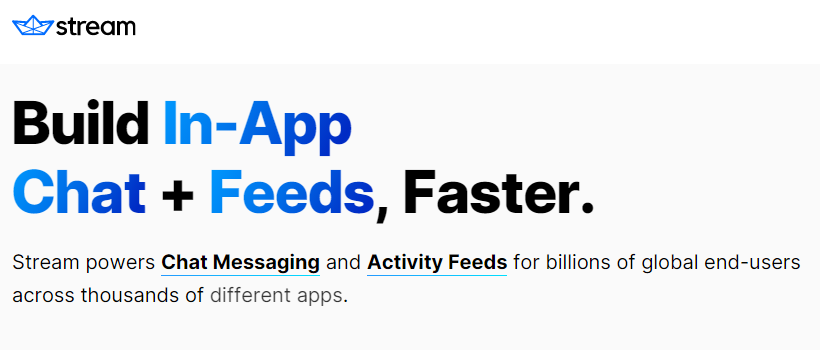

# ChatApp made with GetStream.io

## Funcionalidades
- [x] Signup
- [x] Signin
- [x] Logout
- [x] Create Chat
- [x] Chat
- [x] Delete Chat

## Dependencias
- Vite 4.1.0
- React 18.2.0
- React Select 5.7.0
- TailWindCSS 3.2.7
- React Query 4.26.1
- Wretch 2.5.1
- Stream Chat 8.4.1
- Stream Chat React 10.7.2

## Descripción

Esta aplicación sencilla utiliza [getstream.io](https://getstream.io/) para implementar un chat funcional que permite la comunicación con una o varias personas. Los chats se manejan mediante la asignación de roles a sus miembros permitiendo tener una estructura jerárquica organizada para la gestión de las comunicaciones y el control del chat. Esto facilita la distribución de responsabilidades de administración y moderación de cada chat. Para la implementación se ha utilizado el SDK de React.
 

## Resultado

### Signup

 

### Signin

### Home

### New Chat

 

 

### Chat

 

### Delete Chat

Aux Click (right click to delete)

 
 

## Versionamiento

(Tiber) **Marzo 2023 v1.0.0**
* Signup
* Signin
* Logout
* Create Chat
* Chat
* Delete Chat